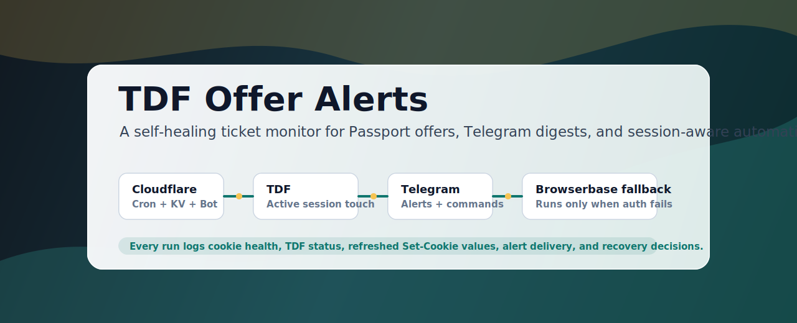
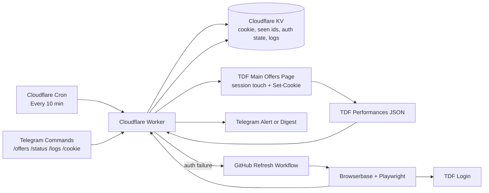

<p align="center">
  
</p>

# TDF Offer Alerts

TDF Offer Alerts is a small, session-aware monitoring system for TDF Passport availability. It watches current offers, sends clean Telegram updates, keeps the authenticated session warm, records detailed operational logs, and uses Browserbase only when the saved session actually breaks.

The core idea is simple: do the cheap reliable thing every 10 minutes, and use the expensive browser automation only as a recovery tool.

## The Problem

TDF offers are time-sensitive, but the useful data sits behind an authenticated session. A naive monitor has three problems:

- It can miss new performances because checks are manual.
- It can lose access when cookies expire or security cookies rotate.
- It can fail silently because “not logged in,” “TDF returned 500,” and “Telegram failed” all look like generic breakage unless every step is logged.

This project solves that by treating authentication as part of the product, not an afterthought.

## What It Does

- Checks TDF every 10 minutes from Cloudflare.
- Sends Telegram alerts only for newly seen performances.
- Sends a daily 9am New York digest of all current offers.
- Lets you ask the bot for `/offers`, `/status`, `/logs`, and `/cookie`.
- Touches the authenticated TDF page before fetching JSON, so TDF sees real session activity.
- Captures and persists refreshed `Set-Cookie` values back into Cloudflare KV.
- Automatically tries a Browserbase refresh once when auth fails.
- Throttles refresh attempts and failure alerts so it does not burn browser minutes or spam Telegram.
- Stores structured logs for every meaningful decision.

## Why The Design Is Smart

The system deliberately separates the common path from the recovery path.

| Concern | Decision | Why |
|---|---|---|
| Normal monitoring | Cloudflare Worker + Cron | Free-tier friendly, always-on, no laptop needed |
| State | Cloudflare KV | Cookie, seen offers, auth state, and logs live close to the Worker |
| Alerts | Telegram | Fast, free, works on phone and desktop |
| Session keepalive | Touch main TDF offers page before JSON | The page returns authenticated HTML and can send refreshed cookies |
| Cookie refresh | Merge `Set-Cookie` back into KV | Keeps server/browser session metadata fresh when TDF rotates it |
| Browser automation | Browserbase only after auth failure | Avoids paying for browser minutes on every check |
| Recovery automation | GitHub refresh workflow dispatched by Worker | Cloudflare cannot run Chromium; GitHub can run the Browserbase script |
| Safety | Captcha-resilient, not captcha-bypassing | Stops and alerts when human verification is required |
| Debuggability | Structured logs for every run | Future failures become inspectable instead of mysterious |

## Architecture



## The Happy Path

1. Worker reads `TDF_COOKIE` from KV.
2. Worker opens `https://nycgw47.tdf.org/TDFCustomOfferings/Current`.
3. It verifies logged-in page signals such as current offers and logout text.
4. It captures any `Set-Cookie` headers and merges changed values into the stored cookie.
5. It calls `Current?handler=Performances`.
6. It diffs `productionSeasonId:performanceId` against `SEEN_OFFERS`.
7. It sends one Telegram summary and one timestamped details file only when something new appears.
8. It writes a structured log entry to `RUN_LOGS`.

## The Recovery Path

When the cookie fails:

1. Worker classifies the failure as `auth`, `transient`, or `unexpected`.
2. It sends a throttled Telegram failure notice.
3. If the failure is `auth`, it dispatches `.github/workflows/refresh-cookie.yml`.
4. GitHub runs `npm run login:browserbase`.
5. Browserbase logs in through Playwright, verifies TDF JSON, and posts the fresh cookie back to the Worker.
6. Worker stores the refreshed cookie in KV.
7. The next check resumes normally.

Refresh attempts are throttled to once every 6 hours. That protects Browserbase free minutes if TDF is down or showing a challenge.

## Product Surface

Telegram is the interface:

| Command | Result |
|---|---|
| `/offers` | Current TDF offers summary plus timestamped details file |
| `/status` | Confirms whether the saved cookie can access TDF |
| `/logs` | Recent run summaries directly in Telegram |
| `/cookie` | Private Cloudflare form URL for manually saving a fresh cookie |

Private HTTP endpoints are also available with `COOKIE_FORM_TOKEN`:

| Endpoint | Purpose |
|---|---|
| `/run-delta?token=...` | Run the delta checker now |
| `/run-daily?token=...` | Send the current digest now |
| `/logs?token=...` | Inspect full structured logs as JSON |
| `/cookie?token=...` | Paste and validate a fresh cookie |

## Logs Built For Future Us

Every run records enough detail to answer “where did it fail?” later:

- run id, event, trigger, start/end time, duration
- cookie byte length and whether expected session cookies exist
- main-page status, final URL, content type, authenticated page signals
- `Set-Cookie` count and cookie names refreshed by TDF
- JSON endpoint status, content type, body size, offer counts
- seen-state count, diff count, and whether alerts were skipped or sent
- Telegram message/document delivery steps
- failure classification and notification throttle decision
- Browserbase refresh dispatch status, GitHub target, and throttle state

Example successful delta log shape:

```json
{
  "event": "delta",
  "status": "success",
  "shows": 4,
  "performances": 63,
  "newPerformances": 0,
  "steps": [
    "read-cookie:success",
    "touch-tdf-main-page:success",
    "fetch-tdf-performances:success",
    "persist-refreshed-cookie:success",
    "read-seen-state:success",
    "diff-offers:success",
    "send-delta-alert:skipped",
    "clear-auth-state:success"
  ]
}
```

## Scheduling

Cloudflare Cron is configured in `wrangler.toml`:

- `*/10 * * * *`: delta check every 10 minutes.
- `0 13 * * *` and `0 14 * * *`: daily digest guard for 9am America/New_York.

The two daily cron entries cover daylight saving time. The Worker sends only when New York local hour is actually `09`.

## Operational Decisions

### Why Cloudflare Worker instead of GitHub Actions for monitoring?

Cloudflare already owns the Telegram webhook, the cookie form, KV state, and cron. Running the monitor there removes GitHub environment plumbing from the common path and keeps state close to the runtime.

### Why keep one GitHub Action?

Only because Cloudflare Workers cannot run Chromium. The remaining GitHub workflow is not a checker; it is a Browserbase refresh runner triggered only when the Worker detects auth failure.

### Why touch the main page before JSON?

The JSON endpoint returns the data but did not return refreshed cookies in testing. The main TDF page returned authenticated HTML and `Set-Cookie`. Touching the main page makes the session look active and gives us a chance to persist server-side cookie rotation.

### Can we prevent cookie expiry forever?

No. TDF can still invalidate a session server-side, rotate security state, or require a human challenge. The system minimizes expiry risk with authenticated activity and cookie merging, then recovers automatically when possible.

### What happens if captcha appears?

The Browserbase script stops. This is intentional. The system is captcha-resilient, not captcha-bypassing. It will log the failure and require manual refresh through `/cookie` or `npm run login:local`.

## Setup

Install dependencies:

```sh
npm install
```

Run tests:

```sh
npm run check
npm test
```

Deploy Worker:

```sh
npm run worker:deploy
```

## Required Secrets

Cloudflare Worker secrets:

```text
TELEGRAM_BOT_TOKEN
TELEGRAM_CHAT_ID
COOKIE_FORM_TOKEN
GITHUB_REFRESH_TOKEN
```

Cloudflare Worker vars:

```text
GITHUB_REPOSITORY=salmanrazzaq-94/tdf-offer-alerts
GITHUB_REFRESH_REF=main
```

GitHub Actions secrets for the refresh workflow:

```text
BROWSERBASE_API_KEY
BROWSERBASE_PROJECT_ID
BROWSERBASE_CONTEXT_ID
TDF_EMAIL
TDF_PASSWORD
COOKIE_FORM_TOKEN
WORKER_BASE_URL
```

Local `.env` for manual refresh/testing:

```text
COOKIE_FORM_TOKEN=
WORKER_BASE_URL=https://tdf-alerts-bot.salmanrazzaq94.workers.dev
BROWSERBASE_API_KEY=
BROWSERBASE_PROJECT_ID=
BROWSERBASE_CONTEXT_ID=
TDF_EMAIL=
TDF_PASSWORD=
```

## Browserbase Refresh

Run manually only when needed:

```sh
npm run login:browserbase
```

The script:

- opens Browserbase headless with Playwright over CDP
- logs into `https://my.tdf.org/account/login`
- stops if TDF shows a captcha, access-denied page, or security challenge
- verifies the performances endpoint
- saves `TDF_COOKIE` to `.env`
- updates Cloudflare KV by POSTing to the Worker cookie endpoint

## Manual Fallback

If Browserbase hits a human challenge:

```sh
npm run install-browser
npm run login:local
```

Then paste the saved cookie with `/cookie`.

## Test Coverage

The test suite covers:

- TDF offer parsing and validation
- first-run, repeated-run, and new-performance diffing
- Telegram summary and details-file formatting
- current digest formatting with no `NEW` markers
- Worker happy path with main-page cookie refresh merge
- auth failure dispatching one Browserbase refresh
- repeated auth failure being throttled

## Security Notes

Keep these out of git:

- `TDF_COOKIE`
- `TELEGRAM_BOT_TOKEN`
- `TELEGRAM_CHAT_ID`
- `COOKIE_FORM_TOKEN`
- `GITHUB_REFRESH_TOKEN`
- `BROWSERBASE_API_KEY`
- `BROWSERBASE_PROJECT_ID`
- `BROWSERBASE_CONTEXT_ID`
- `TDF_EMAIL`
- `TDF_PASSWORD`

Never commit `.env`, exported cookies, logged-in screenshots, or browser storage files.

## Current Status

The deployed Worker has been end-to-end tested:

- Cloudflare cron deploy works.
- Main-page session touch succeeds.
- Refreshed cookies are merged and persisted.
- TDF JSON fetch returns current offers.
- Telegram commands work.
- Automatic Browserbase refresh workflow succeeds.
- A deliberately broken cookie triggered auth detection, refresh dispatch, Browserbase login, KV update, and restored normal checks after KV propagation.
