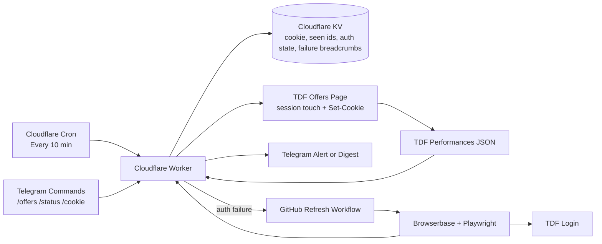

<p align="center">
  
</p>

# TDF Offer Alerts

[](https://github.com/salmanrazzaq-94/tdf-offer-alerts/actions/workflows/pre-check.yml)
[](https://github.com/salmanrazzaq-94/tdf-offer-alerts/actions/workflows/worker-smoke.yml)


TDF Offer Alerts is a self-healing Cloudflare Worker that watches authenticated TDF Passport availability, sends Telegram updates, and recovers broken sessions with Browserbase only when the saved login actually fails.

It is a small app, but it is built like production software: strict TypeScript, deterministic integration tests, isolated E2E checks, protected main deploys, and operational logs for every meaningful decision.

## What It Does

- Checks TDF every 10 minutes and sends Telegram alerts only for newly seen performances.
- Sends a daily 9am New York digest of all current offers.
- Supports `/offers`, `/status`, `/cookie`, `/help`, and `/start` through Telegram.
- Keeps the authenticated session warm by touching the main TDF offers page before fetching JSON.
- Persists refreshed `Set-Cookie` values back into Cloudflare KV.
- Dispatches a GitHub Browserbase refresh only after auth failures.
- Recovers from corrupted KV state without spamming Telegram.
- Keeps production deploys locked to protected `main`.

## Architecture



More detail: [Architecture](docs/architecture.md), [Operations](docs/operations.md), and [Startup Guide](docs/startup-guide.md).

## Why This Is Production-Grade

| Control | What it protects |
|---|---|
| Protected `main` with required `pre-check` and `e2e` | No direct unverified production changes |
| `npm run quality` | One local and CI gate for typecheck, lint, Knip, coverage, and Wrangler dry-run |
| Strict TypeScript | Worker, scripts, and tests are type checked before merge |
| Typed ESLint with zero warnings | Catches async and correctness issues beyond formatting |
| Knip | Prevents unused files, exports, and dependencies from drifting |
| 80%+ line and branch coverage gates | Keeps tests above the meaningful threshold without chasing fake 100% |
| Isolated E2E Worker | Exercises noisy paths without touching production KV or Telegram chat |
| Main-only production deploy | Deploy workflow runs only from protected `main`; local production deploy refuses to run |
| Quiet production smoke | Checks `/health`, `/debug`, and `/verify-cookie` without sending alerts |
| Browserbase recovery throttling | Avoids burning browser minutes or spamming on repeated auth failures |
| Corrupted KV recovery tests | Bad stored state is recoverable and logged instead of silently breaking checks |

## Failure Modes Covered

| Failure mode | Behavior |
|---|---|
| TDF cookie expires | Worker classifies `auth`, dispatches Browserbase refresh, suppresses noisy Telegram if recovery starts |
| GitHub refresh dispatch fails | Telegram attention alert explains that automatic recovery could not start |
| Browserbase refresh fails | Refresh workflow posts back to `/refresh-failed`; Worker logs and alerts once per throttle window |
| TDF returns transient 5xx/429 | Worker retries, then sends a temporary-failure alert if retries exhaust |
| Telegram details upload fails | Summary still counts as sent; document failure is logged without misclassifying auth |
| Telegram summary send fails | Run records the failed send before failure handling continues |
| Corrupted `SEEN_OFFERS` | Worker recovers from current TDF snapshot and avoids a full-current spam alert |
| Corrupted run logs or metadata | Debug and verification paths keep working with safe defaults |
| Overlapping cron runs | Best-effort lock skips duplicate scheduled delta checks |
| Human challenge or captcha | Browserbase stops; manual `/cookie` refresh remains the fallback |

## Product Surface

Telegram is the primary interface.

| Command | Result |
|---|---|
| `/offers` | Current TDF offers summary plus timestamped details file |
| `/status` | Cookie health, recent recovery state, and worker version |
| `/cookie` | Private form URL for pasting a fresh TDF cookie |
| `/help` / `/start` | Command list |

Private HTTP endpoints are guarded by `COOKIE_FORM_TOKEN`.

| Endpoint | Purpose |
|---|---|
| `/run-delta?token=...` | Run the delta checker now |
| `/run-daily?token=...` | Send the current digest now |
| `/verify-cookie?token=...` | Validate the saved cookie without sending Telegram |
| `/debug?token=...` | Operator snapshot for cookie, auth, health, and failure state |
| `/cookie?token=...` | Paste and validate a fresh cookie |

Sanitized examples: [Telegram messages](docs/examples/telegram-offers.md) and [run logs](docs/examples/run-log.md).

## Local Development

For a complete machine setup and recovery runbook, use [docs/startup-guide.md](docs/startup-guide.md).

Install dependencies:

```sh
npm install
```

Run the full local gate:

```sh
npm run quality
```

Useful focused commands:

```sh
npm test
npm run worker:dry-run
npm run smoke:worker
```

Manual refresh when Browserbase cannot solve the session:

```sh
npm run install-browser
npm run login:local
```

## Documentation

- [Startup Guide](docs/startup-guide.md): local setup, environment recovery, and deployment orientation.
- [Architecture](docs/architecture.md): system flow, state model, recovery loop, and CI/E2E topology.
- [Operations](docs/operations.md): secrets, manual recovery, smoke checks, and failure triage.
- [Testing and Quality Gates](TESTING.md): local and CI verification contract.
- [Telegram examples](docs/examples/telegram-offers.md): redacted message examples.
- [Run log examples](docs/examples/run-log.md): redacted Cloudflare log and failure breadcrumb examples.

## Security Notes

Never commit `.env`, exported cookies, logged-in screenshots, browser storage files, Telegram tokens, TDF credentials, Browserbase keys, GitHub refresh tokens, Cloudflare tokens, or real chat IDs.

The repository examples intentionally use fake show names, fake run ids, and redacted secret values.
