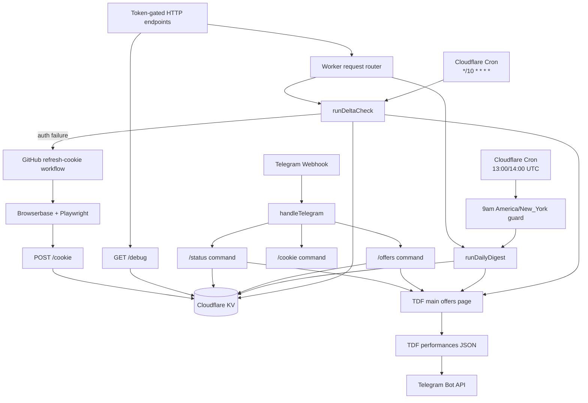

# Architecture

TDF Offer Alerts is intentionally small: one Cloudflare Worker owns monitoring, Telegram commands, token-gated HTTP endpoints, state in KV, and dispatching the Browserbase recovery workflow when auth breaks.

## Runtime Topology

## State Model

Cloudflare KV stores the operational state needed to keep the Worker stateless between requests:

| Key | Purpose |
|---|---|
| `TDF_COOKIE` | Current saved cookie header used for authenticated TDF requests |
| `TDF_COOKIE_META` | Source, save timestamp, byte length, and expected-cookie flags |
| `SEEN_OFFERS` | Sorted `productionSeasonId:performanceId` ids already observed |
| `AUTH_STATE` | Last auth failure, notification timestamp, and refresh-dispatch status |
| `HEALTH_STATE` | Last successful delta timestamp and stale-success notification state |
| `DELTA_LOCK` | Best-effort cron overlap guard |

The Worker treats KV as recoverable product state, not a logging database. Tests cover corrupted seen state, metadata, auth state, health state, and delta lock recovery.

If KV rejects refreshed-cookie writes, the Worker keeps a one-day emergency cookie fallback in isolate memory and attempts Cloudflare Cache API. This avoids repeated Browserbase dispatches during a same-day KV write outage, but it is intentionally secondary to KV and not a durable database.

## Normal Delta Flow

1. Read `TDF_COOKIE` from KV.
2. Touch the TDF main offers page to verify authenticated HTML and collect refreshed `Set-Cookie` values.
3. Merge refreshed cookie values back into the saved cookie when TDF rotates them.
4. Fetch the TDF performances JSON endpoint.
5. Flatten performances into stable alert ids.
6. Compare current ids with `SEEN_OFFERS`.
7. Send Telegram summary and details file only when new performances appear.
8. Write changed product state and emit a structured Cloudflare Workers Logs summary.

The scheduled delta flow is also the keepalive path. There is no separate artificial pinger.

## Recovery Flow

Auth failures are handled differently from transient and unexpected failures:

1. The Worker classifies the failure as `auth`, `transient`, or `unexpected`.
2. Auth failures may dispatch `.github/workflows/refresh-cookie.yml`.
3. GitHub runs `npm run login:browserbase`.
4. Browserbase logs into TDF with Playwright, verifies the TDF JSON endpoint, and posts the fresh cookie to `/cookie`.
5. The Worker validates the posted cookie before saving it to KV.
6. If Browserbase fails, the workflow calls `/refresh-failed`, and the Worker sends a throttled Telegram attention alert.

Refresh attempts are throttled so repeated failures do not burn browser minutes or spam Telegram.

## CI and E2E Topology

Pull requests run two required checks:

| Job | Purpose |
|---|---|
| `pre-check` | Runs `npm run quality`: typecheck, lint, Knip, coverage-gated tests, and Wrangler dry-run |
| `e2e` | Deploys an isolated E2E Worker, refreshes a cookie through Browserbase, and exercises Worker + Telegram paths |

The E2E job uses separate Cloudflare resources and secrets from production. It covers `/cookie`, `/verify-cookie`, `/run-delta`, `/run-daily`, operator `/debug`, supported Telegram commands, and `/refresh-failed`.

Production deploys are only triggered by pushes to protected `main`. The deploy workflow runs `npm run quality`, deploys the Worker, then runs quiet production smoke checks.
